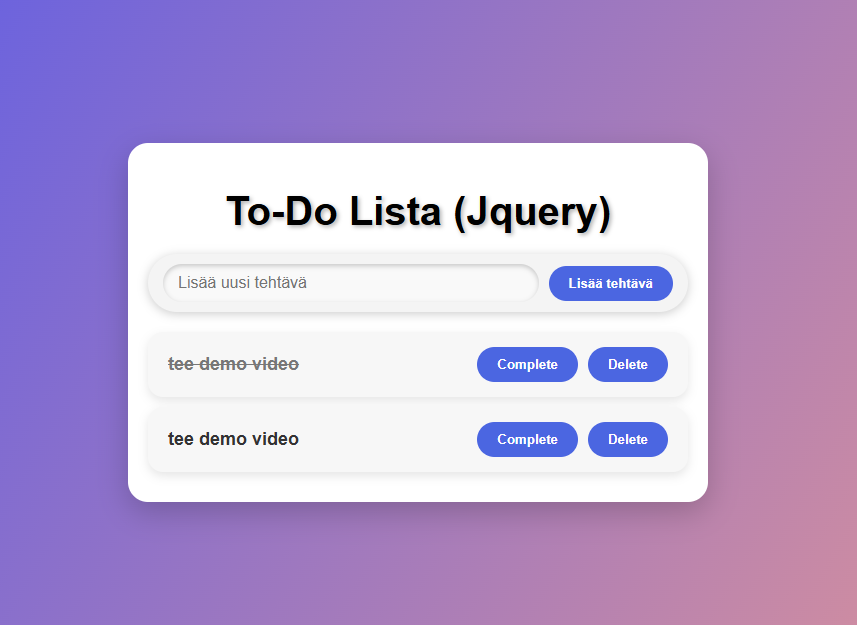

# Projekti 2b - Jquery
To-Do Lista sovellus Jqueryllä - Teemu Markus ja Jenni Koivisto

## Demo linkki
Tästä linkist pääset sovellukseen[To-Do Lista](https://jqueryproje.netlify.app)

## Työnjako
Teimme projektin parityönä ja työnjako meni 50/50. Molemmat tekivät omat osuutensa, jotta ohjelmasta saataisiin toimiva Jqueryä käyttäen.
Käytetty aika tunteina:
Teemu - 4h
Jenni - 4h

## Table of Content
- [About the app](#about-the-app)
- [Screenshot](#screenshot)
- [Teknologiat](#teknologiat)
- [Setup](#setup)
- [Status](#status)
- [Credits](#credits)
- [License](#license)

## About the app
Tekemäni To-Do Lista on sovellus, jossa voi itse lisätä listaan asioita, jotka pitää tehdä. Ne voi olla esimerkiksi koulutehtäviä tai vaikkapa kauppalista.

## Screenshot

## Teknologiat
Tässä projektissa käytin seuraavia teknologioita: HTML, CSS sekä Javascript (Jquery).

## Setup
Miten käynnistät sovelluksen:
     Avaa Demo linkki kohdassa oleva linkki
    --> Lataa tiedostot omalle koneellesi
    --> Avaa ladatut tiedostot Visual Studio Code - editorissa
    --> Voi nyt avata tiedoston index.html käyttäen esimerkiksi Liveserver lisäosaa Visual Studio Coden sisällä.

## Status
Valmis

## Credits
[Greatstack](https://www.youtube.com/watch?v=G0jO8kUrg-I&t=960s)

## License
MIT license @[markutee](https://github.com/markutee/Jsprojekti1?tab=MIT-1-ov-file)
